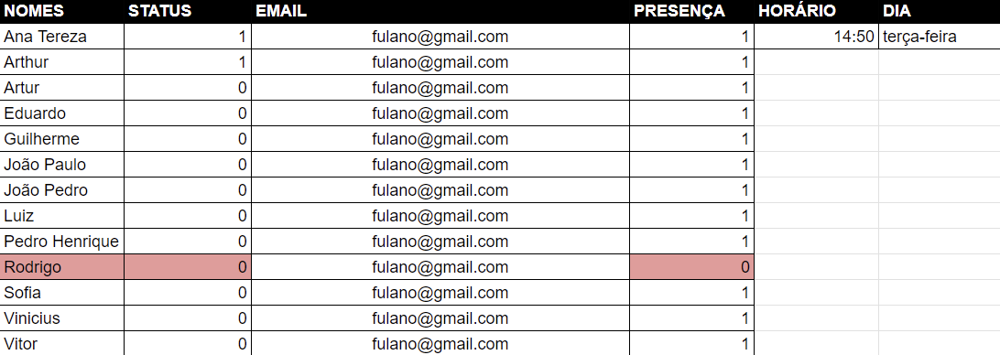
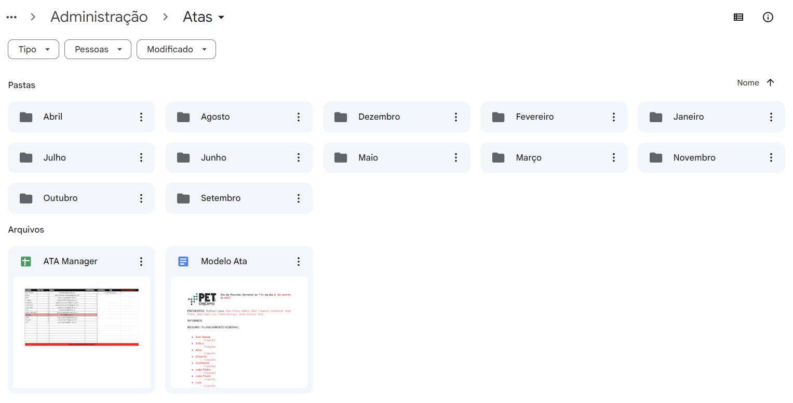

# [PET](https://pet.inf.ufes.br/) Gerenciador de atas :gear:

## Requisitos :arrow_down:
 - Primeiramente, crie um arquivo de crendenciais no Google Cloud Developers, nomeie como **credentials.json**, e insira-o na pasta *credentials/*.
 - Para criar este arquivo, ative as API`s do Google Drive e do Google Sheets.
 - Antes de rodar o container, é necessário a autenticação deste arquivo de credenciais. Dessa forma, após terminar a leitura desta sessão, vá para a sessão que ensina a executar o código fora do docker. Essa execução é necessária para você autorizar a aplicação a ter acesso ao seu *Google Drive* e a criação automática de um arquivo chamado *token.json*.
 - Copie o arquivo **.env.example** e renomeie a cópia como **.env**. Agora adicione as variáveis de ambiente correspondentes (no primeiro arquivo citado há o detalhamento de cada variável de ambiente).
 - Crie uma senha de aplicativo para o email que enviará as mensagens.
 - Este script deve ser utilizado no drive compartilhado do PET.

## Como funciona?
 - Para utilizar este script é necessário a criação de uma planilha do seguinte modelo:
    
 - A primeira coluna contém o nome de todos os petianos.
 - A segunda coluna (STATUS) corresponde a quem já preencheu a ATA nesta respectiva rodada. Todos que estiverem com 1, já preencheram, e os que estiverem com 0, ainda não preencheram. Assim que todos estiverem o valor 1, a coluna reseta para 0.
 - A terceira coluna corresponde aos respectivos email dos petianos.
 - A quarta coluna (PRESENÇA) corresponde a quem está presente na reunião. Caso a pessoa não esteja presente e for sua vez de preencher a ATA, ela será pulada nesta rodada e acionada na próxima. **Nesta coluna o Rodrigo sempre terá o valor 0, pois ele não preenche a ATA**.
 - A quinta coluna corresponde ao horário em que o script irá funcionar. **Atente-se ao formato hh:mm**.
 - A sexta e última coluna possui o dia da reunião. **Só podem ser utilizados dias de segunda-feira à sexta-feira. Os nomes dos dias são com letra minúscula e separados por hífem**.
 - O script recolhe os dados da planilha toda vez que ele roda, ou seja, se deseja mudar algum parâmetro da planilha, o script só colherá os dados no dia em que foi agendado previamente (com valores antigos da planilha). **Caso precise mudar algo de imediato, pare a sua execução e inicie novamente**.
 - Esta planilha deve estar numa pasta acompanhada do **Modelo Ata** (O arquivo deve ter exatamente este nome) e de vários diretórios com o nome de todos os meses do ano com as iniciais maiúsculas. 
    

### Para usar com o docker :whale:
 - No diretório já possui um dockerfile, basta fazer o *build* da imagem utilizando o comando abaixo e inserindo o nome da imagem no local indicado:
```bash
sudo docker build -t <nome da imagem> . 
```
 - Com a imagem pronta, basta rodar o *container* com as flags de sua preferência, por exemplo:
```bash
sudo docker run --name <nome do container> -d --restart=always <nome da imagem> 
```
#### OBS
 - Para fazer o *deploy* na nossa *VM*, utilizamos o portainer.
 - O *build* da imagem a é criado a partir deste repositório.

### Para usar sem o docker
 - Para utilizar fora de um container, primeiramente é necessária a instalação das bibliotecas. Execute o comando abaixo a partir do diretório *root*: 
```bash
pip install -r documentation/requirements.txt
```
**Se preferir pode fazer a utilização do *virtualenv* do Python**

Para executar basta estar no diretório *root* do script e executar o seguinte comando:
```bash
python3 src/main.py
```
#

##### Em caso de dúvidas, entre em contato:
<a href = "mailto:joaopaulomoura5328@gmail.com"></a>
